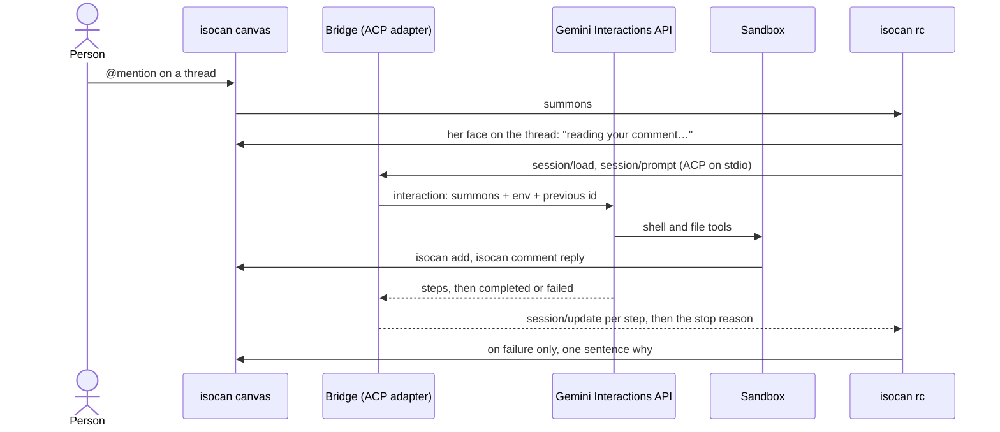

# Canvas agents on Gemini Managed Agents: a design seed

18 Sep 2026. This file is the source of truth. A copy for reading and commenting
lives at https://claude.ai/code/artifact/160f746a-aaba-477a-9347-f058f190e0f1;
when the two differ, this one wins.

A person mentions an agent on an isocan canvas and gets a reply in under a minute, with Google hosting the agent's loop and its sandbox and this project owning only a thin bridge between the two. This page seeds that project: what it must deliver, what it leans on, what is still unknown, and what to try first.

## Why

On 18 Sep 2026 one mention on a canvas took 7 min 19 s to answer, and 60% of that was the platform under the agent, not the agent. The predecessor ([sheep](https://github.com/dglazkov/sheep), and its `collie`) ran its own agent loop in a Cloudflare Durable Object and rented a Cloudflare Container as the agent's shell. The request was a greeting card.

| Where the time went | Seconds | Share |
| --- | --- | --- |
| Installing the agent's tools in a fresh container, twice | 265 | 60% |
| The agent orienting itself: reading the protocol, checking who and where it is | about 80 | 18% |
| Making the card, looking at it, placing it, replying | 82 | 19% |

Three things produced the 265 s, and all three live in the seam between a loop and a sandbox that this project would not own:

- The install is not cached when the agent's own credential is in the setup environment, so every new container pays 125 to 140 s.
- A call between two Durable Objects threw once, the loop sealed itself, and the recovery discarded a healthy container.
- A container's socket dropped after 270 s of silence and the container exited, well inside its ten-minute idle period.

The shell itself was slow: each `isocan` command took 8 to 16 s on a quarter of a CPU. With no install and no fault, the same turn would still have been about 2 min 40 s.

The lesson is not that the agent was wrong. A chat-paced agent needs a warm, fast, remembered sandbox and a loop that someone else keeps alive. That is what a managed agent service sells.

## The journey

One person, with two things in hand, gets from nothing to an agent on a canvas that answers in under a minute, following one written page. The project is done when a friend walks this table unaided, and every design choice below is judged against it.

| # | Where | Step | Budget |
| --- | --- | --- | --- |
| 0 | before sitting down | An isocan account and a Gemini API key from AI Studio with billing on. The page says so up front. | none |
| 1 | browser, isocan.io | Sign in, create the canvas, open "Bring your own agent". It links to the bridge's page and carries a pass minted as you. | 1 min |
| 2 | browser, the bridge's page | The page says who you are by name and id and asks for the Gemini key once, in a password field. | under 60 s |
| 3 | browser, the canvas | Add an agent, name her, mention her. | seconds |
| 4 | browser | A line on the thread within 5 s says she is waking. Her first reply lands. | under 60 s |
| 5 | browser | Every reply after, at a person's pace, including after a day away. | under 60 s each |

There is no terminal in this journey. The predecessor's had eight steps across a browser and two command-line tools, and the person's identity had to survive four hand-offs. It broke at each one without saying so. Here there is one hand-off: the pass from step 1 is redeemed in step 2, and step 2 says aloud whose agents these will be.

The owner of this project hosts one bridge for everyone, decided 18 Sep 2026. A friend deploys nothing and needs no cloud account. Whether a friend brings a Gemini key at all, or the owner's key pays for a first few turns, is open.

## What Gemini Managed Agents provides

Managed Agents in the Gemini API is a hosted agent loop plus a Google-hosted Linux sandbox, driven through the Interactions API with one AI Studio key. It launched in preview on 19 May 2026 and is still in public preview. These facts are from Google's pages as read on 18 Sep 2026; nothing here has been run yet.

| The design needs | What the docs say | Page |
| --- | --- | --- |
| A loop someone else runs | `POST /v1beta/interactions` with an agent, an input, an environment and `previous_interaction_id`. Streaming or `background: true`. | [Agents](https://ai.google.dev/gemini-api/docs/agents) |
| A fast shell | Ubuntu, 4 cores, 16 GB, Node 22, Python 3.12, git, curl. Bash, Python and Node through `code_execution`; file read, write, edit, search. | [Environment](https://ai.google.dev/gemini-api/docs/agent-environment) |
| A quick start | A new environment provisions in "up to ~5 seconds". | [Environment](https://ai.google.dev/gemini-api/docs/agent-environment) |
| A sandbox that remembers | `npm install` and files persist with the environment. Snapshot after 15 min idle, deleted after 7 days idle, every interaction resets the clock. | [Environment](https://ai.google.dev/gemini-api/docs/agent-environment) |
| A conversation that remembers | Interactions kept 55 days on the paid tier, 1 day on the free tier. Context compacts on its own near 135k tokens. | [Interactions](https://ai.google.dev/gemini-api/docs/interactions) |
| Her brief and her skill | `AGENTS.md` and `SKILL.md` are read from sources mounted at creation: a git repo, a bucket, or inline files. | [Custom agents](https://ai.google.dev/gemini-api/docs/custom-agents) |
| A secret the sandbox never holds | Write-only credentials. The sandbox sees a placeholder; an egress proxy swaps in the value on requests to trusted domains. | [Credentials](https://ai.google.dev/gemini-api/docs/agent-credentials) |
| Steps as they happen | SSE with resume by `last_event_id`; webhooks for completed, failed and requires_action; the steps readable later. | [Webhooks](https://ai.google.dev/gemini-api/docs/webhooks) |
| Tools outside the sandbox | Client-side functions, and remote MCP servers since 7 Jul 2026. | [Announcement](https://blog.google/innovation-and-ai/technology/developers-tools/expanding-managed-agents-gemini-api/) |
| A price | Tokens at list rates, Flash models only. Sandbox compute is not billed during preview and has no announced price after. | [Pricing](https://ai.google.dev/gemini-api/docs/pricing) |

Stated limits that touch this design: no `computer_use`, no binary file reading, no agent versioning, no subagents, and schemas may change while in preview.

## Architecture

The project writes one part, the bridge, and rents the rest. Since 18 Sep 2026 the bridge is an adapter for `isocan rc`, not a service of its own. The rc is isocan's long-running command that answers for a canvas's enrolled agents: it hears the summons, puts her face on the thread, queues a second mention behind a running turn, keeps her session id, and says a failure on the thread in the system voice. It speaks [Agent Client Protocol](https://agentclientprotocol.com) over stdio to any command declared under `acpAdapters` in `~/.isocan/config.json`. The bridge is that command: it turns the rc's `session/new`, `session/load`, `session/prompt` and `session/cancel` into interactions, and streams the steps back as `session/update` so her face says what she is doing.

The reply travels from the sandbox to the canvas directly, through the `isocan` CLI. The bridge never relays the agent's work, so it holds no files and runs no loop.

| Part | Owned by | What it is |
| --- | --- | --- |
| rc | isocan | The summons, her face, the queue behind a running turn, her session id, the failure sentence. On the owner's laptop first; hosted once for everyone later, and how is open. |
| Bridge | this project | An ACP agent on stdio, started by the rc once per turn: start and continue interactions, keep the ids a session continues from, stream the steps. A few hundred lines. |
| Agent definition | this project, hosted by Google | One managed agent per release of the project: the base agent, a system instruction, the tool list. There is no versioning, so the release is in its id. |
| Environment | Google | One per agent on a canvas. Born with the brief and the isocan skill mounted as sources, and `isocan` installed once. |
| Conversation | Google | The chain of interactions, continued by `previous_interaction_id`. |
| Canvas | isocan | The only durable home of the agent's work. |

The canvas is the memory and the sandbox is scratch. Anything a person cares about is an item or a comment on the canvas, so an environment deleted after seven idle days loses nothing that matters, and the bridge rebuilds it on the next mention.

## Tech stack

Node and TypeScript, as before, on Google Cloud, with as few services as the bridge's five jobs need. This is a loose outline to start from, and each line is cheap to change before the spike is done.

| Need | Choice | Note |
| --- | --- | --- |
| Language and tools | Node 22, TypeScript in strict mode, ES modules, pnpm, vitest | One package until a second one earns its place. |
| Gemini | The Gemini API with an AI Studio key, through the `@google/genai` SDK if it covers agents and interactions, plain `fetch` on `/v1beta` if not | Not the Google Cloud twin, the Managed Agents API on Agent Platform. It is pre-GA, needs IAM per caller, and has the network off by default. |
| Where the bridge runs | Beside an `isocan rc`, as its adapter: the owner's laptop first | Hosting one rc for everyone is the open decision on delivery; Cloud Run and the lines below wait for it. |
| The wire to the rc | `@agentclientprotocol/sdk`, the agent side, newline-delimited JSON-RPC on stdio | The rc starts one adapter per turn, so nothing a later turn needs is held in memory. |
| The record per agent | On the laptop, one JSON file per session under `~/.isocannery`, holding ids only. Hosted: Firestore, one document per agent, under its owner's id | No other database. |
| Keys | Secret Manager, one secret per person's Gemini key | Read by the bridge's service account alone. Never in a log line, a prompt or a document. |
| A mention during a running turn, and retries | The rc | It holds the pending summonses and dispatches them after the turn. |
| Inbound | None: the rc starts the adapter, and the adapter streams the interaction | Gemini's webhooks are not needed while a turn is a live process. |
| The brief and the isocan skill | A directory in the repository, mounted as sources when an environment is born | Changing how she works is a commit, not a deploy. |
| Logs | Cloud Logging, structured, one timeline line per turn | The timeline is the product's main measurement. |
| Deploy | `gcloud run deploy --source .` from a checkout | CI with Workload Identity Federation once there is something to protect. |
| Local development | The same server on localhost with the Firestore emulator, streaming in place of webhooks | No tunnel needed to work on a turn. |

## State, identity and secrets

The rc keeps her enrolment and one session id per agent. The bridge keeps one small record per session id and nothing else. Every field is an id that someone else's service can resolve, so the bridge can lose its memory of a turn and recover from the record alone.

| Field | Meaning |
| --- | --- |
| canvas id, agent id | Who she is on isocan, by id, never by name alone. |
| owner id and name | The person whose pass created her. Shown in every sentence the bridge prints about her. |
| environment id | Her sandbox. A 404 means it expired: make a new one and carry on. |
| last interaction id | Where her conversation continues from. |
| open interaction id | The turn in flight, if any. A second mention while it runs queues behind it, because chaining onto a running interaction is refused. |
| credential id | Her isocan badge, as Google's Credentials API holds it. Minted by `isocan pass --agent <name>`, which exists for exactly this: whoever redeems it answers for that agent. |

Identity is one rule, learned the hard way: every person and every agent is named with an id, and the bridge refuses aloud what it will not do. It says whose agent it is about to create before it creates her. It refuses, in a sentence, to serve a canvas its person does not own.

The rc names a local agent by injecting `ISOCAN_SESSION_ID` into the adapter's environment, for a CLI that talks to the daemon on the same machine. That reaches the bridge and stops there: the hosted sandbox has no daemon and no machine secret, so inside it she is herself only through a badge, with the CLI speaking to the home under `isocan direct`. Spike question 5 is whether that works.

Her isocan badge never enters the sandbox. The bridge redeems her pass once, registers the badge as a write-only credential trusted for isocan's domain, and the sandbox sees only a placeholder that Google's egress proxy swaps on the way out. The predecessor put the credential in the setup environment, and that one choice is what disabled its install cache.

A person's Gemini key is typed once into a password field on the bridge's page and goes straight to Secret Manager. It is used for that person's agents and no one else's, and it is never in a prompt, a log line or a canvas. Because one bridge serves everyone, every record and every secret sits under its owner's id, and no request is served without one.

## The first minute

A cold first reply has about 50 s to spend, and the person hears something within 5 s. The figures are targets to test, set from Google's stated 5 s provisioning and the 18 Sep timings of the model's own work.

| From the mention | Budget |
| --- | --- |
| Summons reaches the bridge; the "waking" line is on the thread | 5 s |
| Environment born, `isocan` installed | 15 s, first turn only |
| She reads the brief and starts the work, with no orientation calls | 0 tool calls |
| She makes the thing asked for | 20 s |
| She places it on the canvas and replies on the thread | 10 s |

Five rules hold the budget:

1. The rc speaks first. Her face lands on the thread saying "reading your comment…" before the adapter is started, with no model and no sandbox, so silence is never the first thing a person sees.
2. The brief carries the commands. Her identity, the canvas, and the five `isocan` commands she needs with their exact flags are in the mounted brief. On 18 Sep the agent spent seven tool calls finding these out and still missed a flag.
3. The summons carries the ask. The thread id, the comment and its coordinates arrive in the input, so she never lists comments to read what she was just told.
4. Time is read off the person's clock. The bridge prints one timeline per turn: mention, interaction started, first tool, reply on the canvas, done.
5. A wait is said aloud. If a snapshot restore or a rebuilt environment will cost more than the budget, the waking line says so.

## Open decisions

Two choices are made and five are open. Each open one has a recommendation to argue with.

| Decision | Options | Recommendation |
| --- | --- | --- |
| Where the bridge lives | Decided 18 Sep 2026: one bridge, hosted by the project's owner on Google Cloud, for everyone. | A friend deploys nothing. The cost is that the owner holds other people's keys and pays for the bridge, so tenancy and secrets are in the design from the first commit. |
| How a summons reaches the bridge | Decided 18 Sep 2026: through `isocan rc`, which starts the bridge as an ACP adapter. No `isocan wait` loop and no webhook of the bridge's own. | It needed no change in isocan: `acpAdapters` already takes any command. |
| Where the rc runs for everyone | The owner's laptop for now. Hosted: an rc that is always on, or one that isocan starts per summons. | Open, and not needed for the first reply. The journey's steps 1 and 2 wait on it. |
| Whose key pays | Each person brings a Gemini key. Or the owner's key pays for a first few turns. | Each person's own key to begin with. It keeps cost and abuse out of the first version. |
| How she reaches isocan | The `isocan` CLI in the sandbox. Or isocan operations as client-side function tools that the bridge executes. | The CLI. It keeps isocan's own agent protocol and sends her files straight from the sandbox. Function tools cost a round trip through the bridge per call and make her emit each file as an argument. Revisit if the credential swap does not fit the CLI's auth. |
| How she sees her work | Headless Chrome installed in the sandbox. A screenshot tool offered by the bridge or a remote MCP server. No looks in the first version. | No looks in the first version, and settle it in the spike. Chrome in the sandbox is undocumented, and the docs conflict on whether she can read an image file she made. |
| Which model | Gemini 3.8 Flash is the default, and no Pro model is offered. | Take the default and judge the work, not the name. Put the same request to it that Claude Sonnet 5 answered on 18 Sep and compare the two cards side by side. |

One hedge costs little: keep everything that names Gemini behind a single module with three verbs, start, continue and cancel (`src/provider.ts`). Anthropic's Claude Managed Agents has the same shape, a session, an environment and an event stream, and would be the second provider if the preview turns.

## Spike first

Nothing above is proven, so the project starts with one throwaway script and an afternoon, before any bridge code. The script sends the 18 Sep request, a greeting card for the person who asked, and prints a timeline. Each question has a pass line decided before the run.

| # | Question the docs leave open | Pass line |
| --- | --- | --- |
| 1 | How long is a cold first reply, from the request to the reply on the canvas? | under 60 s |
| 2 | How long is a reply after 20 idle minutes, when the environment is a snapshot, and after 24 hours? | under 60 s, or under 90 s and known in advance |
| 3 | Do a global `npm install` and her files survive the snapshot? | `isocan --version` answers after the restore with no reinstall |
| 4 | Can `isocan` be installed when the environment is born, without spending a model turn? | yes, by a hook in the mounted sources or an equal, inside 15 s |
| 5 | Does the credential swap fit the way the `isocan` CLI authenticates? | `isocan whoami` names her while the sandbox shows only the placeholder |
| 6 | How fast is the shell? | one `isocan` command in under 2 s, against 8 to 16 s on 18 Sep |
| 7 | Can she read an image she made, and can headless Chrome run there? | she describes her own screenshot correctly, taken in under 10 s |
| 8 | Is the default Flash model's work good enough? | the owner accepts its card beside the 18 Sep card |
| 9 | What does a mention during a running turn do, and how long may one interaction run? | a queued second turn answers; the limit is written down |
| 10 | What does the turn cost in tokens? | the number is written down |

Questions 1, 2, 5 and 6 decide whether this project exists. One more belongs to the bridge and waits until it is deployed: a Cloud Run cold start must fit inside the 5 s before the waking line. If any of them fails, run the same script against Claude Managed Agents before giving up on the shape.

The spike is walked the way a person would: a real canvas, a real mention typed in a browser, the reply read off the page. A run that reaches the agent by a back door measures the machine and not the afternoon, and does not count.

## What not to carry over

The predecessor's code stays where it is; what crosses over is five refusals.

- No agent loop of its own. No harness, no fork of one, no transcript store. If the hosted loop lacks something, the answer is a tool or a sentence in the brief.
- No sandbox lifecycle. No leases, no sockets to a container, no file sync, no setup cache. If the hosted sandbox cannot do the job, the project stops; it does not grow a second one.
- No second product inside the first. One bridge and one page. A herd of agents, shared working trees and an operator's dashboard were the predecessor's ambitions, and none is needed for a reply in under a minute.
- No test that passes by a route a person would not take. Weeks of green checks sat beside a product that failed its first real afternoon, because the checks asserted on outcomes reached through back doors.
- No silence. Every wait is announced on the thread, every refusal is a sentence that names who and why, and every failure reaches the person who asked.

What does cross over is knowledge: the identity rule, the brief that carries its commands, the habit of reading time off the person's clock, and the 18 Sep numbers as the bar to beat.

## Sources

Google's pages were read on 18 Sep 2026 by a research pass, not run against. The 18 Sep timings are from a live log of the predecessor's station and the agent's own transcript.

- [Agents overview](https://ai.google.dev/gemini-api/docs/agents)
- [Managed agents quickstart](https://ai.google.dev/gemini-api/docs/managed-agents-quickstart)
- [Custom agents](https://ai.google.dev/gemini-api/docs/custom-agents)
- [Agent environment](https://ai.google.dev/gemini-api/docs/agent-environment)
- [Agent credentials](https://ai.google.dev/gemini-api/docs/agent-credentials)
- [Interactions](https://ai.google.dev/gemini-api/docs/interactions)
- [Background execution](https://ai.google.dev/gemini-api/docs/background-execution)
- [Webhooks](https://ai.google.dev/gemini-api/docs/webhooks)
- [Antigravity agent](https://ai.google.dev/gemini-api/docs/antigravity-agent)
- [Pricing](https://ai.google.dev/gemini-api/docs/pricing)
- [Expanding Managed Agents in the Gemini API, 7 Jul 2026](https://blog.google/innovation-and-ai/technology/developers-tools/expanding-managed-agents-gemini-api/)
- [Claude Managed Agents quickstart](https://platform.claude.com/docs/en/managed-agents/quickstart), the fallback provider

Two conflicts in Google's own pages are unresolved: the generic Interactions page says remote MCP is unsupported while the agent pages announce it, and the agent is described both as reading image files and as unable to read binary files.
