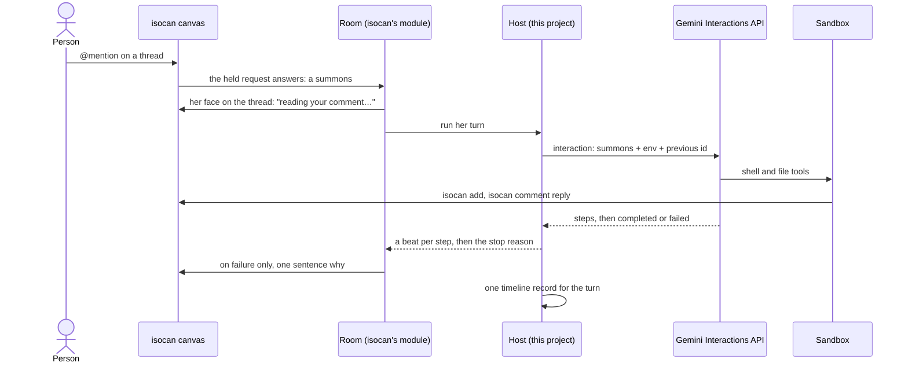

# Canvas agents on Gemini Managed Agents: the design

18 Sep 2026. This file is the source of truth. A copy for reading and commenting
lives at https://claude.ai/code/artifact/160f746a-aaba-477a-9347-f058f190e0f1;
when the two differ, this one wins.

A person adds an agent in a canvas's tray, mentions her, and gets a reply in under a minute. Google hosts the agent's loop and her sandbox. isocan writes the room, the loop that hears a mention and answers it. This project is the service that room runs in: agents.isocan.io, on Cloud Run, with the page that reads it. This page says what it must deliver, what it leans on, what is still unknown, and what comes first.

## Why

On 18 Sep 2026 one mention on a canvas took 7 min 19 s to answer, and 60% of that was the platform under the agent, not the agent. The predecessor ([sheep](https://github.com/dglazkov/sheep), and its `collie`) ran its own agent loop in a Cloudflare Durable Object and rented a Cloudflare Container as the agent's shell. The request was a greeting card.

| Where the time went | Seconds | Share |
| --- | --- | --- |
| Installing the agent's tools in a fresh container, twice | 265 | 60% |
| The agent orienting itself: reading the protocol, checking who and where it is | about 80 | 18% |
| Making the card, looking at it, placing it, replying | 82 | 19% |

Three things produced the 265 s, and all three live in the seam between a loop and a sandbox that this project would not own:

- The install is not cached when the agent's own credential is in the setup environment, so every new container pays 125 to 140 s.
- A call between two Durable Objects threw once, the loop sealed itself, and the recovery discarded a healthy container.
- A container's socket dropped after 270 s of silence and the container exited, well inside its ten-minute idle period.

The shell itself was slow: each `isocan` command took 8 to 16 s on a quarter of a CPU. With no install and no fault, the same turn would still have been about 2 min 40 s.

The lesson is not that the agent was wrong. A chat-paced agent needs a warm, fast, remembered sandbox and a loop that someone else keeps alive. That is what a managed agent service sells.

## The journey

One person, with an isocan account and nothing else, gets from a canvas to an agent on it that answers in under a minute. The project is done when a friend walks this table unaided, and every design choice below is judged against it.

| # | Where | Step | Budget |
| --- | --- | --- | --- |
| 0 | before sitting down | An isocan account. | none |
| 1 | the canvas | Open the tray, add an agent, name her. She runs on agents.isocan.io, the default when no machine of yours is joined. | 30 s |
| 2 | the canvas, first time only | One consent screen, from isocan: agents.isocan.io will answer for the agents you add here, and this is where you turn it off. It says who you are by name and id. | 15 s |
| 3 | the canvas | Mention her. | seconds |
| 4 | the canvas | A line on the thread within 5 s says she is waking. Her first reply lands. | under 60 s |
| 5 | the canvas | Every reply after, at a person's pace, including after a day away. | under 60 s each |
| 6 | the canvas, when the free allowance runs out | One sentence on the thread in the system voice: how much was used, when it resets, and a link. | at once |
| 7 | agents.isocan.io | Your agents by canvas, what is left of the allowance, and the off switch. | none |

There is no terminal, no key and no second site in the first five steps. The predecessor's journey had eight steps across a browser and two command-line tools, and the person's identity had to survive four hand-offs. It broke at each one without saying so. Here there is none: the person is signed in to isocan, and isocan tells the service who they are.

Decided 18 Sep 2026: the owner of this project runs one service for everyone, agents.isocan.io, as a part of isocan and not a bridge beside it. A friend deploys nothing, needs no cloud account, and brings no key: the owner's Gemini key pays, inside a small free allowance per person. Steps 1 and 2 need isocan to know a trusted host (below); until it does, the owner's own canvas is joined by a pass, as the rig's was.

## What Gemini Managed Agents provides

Managed Agents in the Gemini API is a hosted agent loop plus a Google-hosted Linux sandbox, driven through the Interactions API with one AI Studio key. It launched in preview on 19 May 2026 and is still in public preview. These facts are from Google's pages as read on 18 Sep 2026; nothing here has been run yet.

| The design needs | What the docs say | Page |
| --- | --- | --- |
| A loop someone else runs | `POST /v1beta/interactions` with an agent, an input, an environment and `previous_interaction_id`. Streaming or `background: true`. | [Agents](https://ai.google.dev/gemini-api/docs/agents) |
| A fast shell | Ubuntu, 4 cores, 16 GB, Node 22, Python 3.12, git, curl. Bash, Python and Node through `code_execution`; file read, write, edit, search. | [Environment](https://ai.google.dev/gemini-api/docs/agent-environment) |
| A quick start | A new environment provisions in "up to ~5 seconds". | [Environment](https://ai.google.dev/gemini-api/docs/agent-environment) |
| A sandbox that remembers | `npm install` and files persist with the environment. Snapshot after 15 min idle, deleted after 7 days idle, every interaction resets the clock. | [Environment](https://ai.google.dev/gemini-api/docs/agent-environment) |
| A conversation that remembers | Interactions kept 55 days on the paid tier, 1 day on the free tier. Context compacts on its own near 135k tokens. | [Interactions](https://ai.google.dev/gemini-api/docs/interactions) |
| Her brief and her skill | `AGENTS.md` and `SKILL.md` are read from sources mounted at creation: a git repo, a bucket, or inline files. | [Custom agents](https://ai.google.dev/gemini-api/docs/custom-agents) |
| A secret the sandbox never holds | Write-only credentials. The sandbox sees a placeholder; an egress proxy swaps in the value on requests to trusted domains. | [Credentials](https://ai.google.dev/gemini-api/docs/agent-credentials) |
| Steps as they happen | SSE with resume by `last_event_id`; webhooks for completed, failed and requires_action; the steps readable later. | [Webhooks](https://ai.google.dev/gemini-api/docs/webhooks) |
| Tools outside the sandbox | Client-side functions, and remote MCP servers since 7 Jul 2026. | [Announcement](https://blog.google/innovation-and-ai/technology/developers-tools/expanding-managed-agents-gemini-api/) |
| A price | Tokens at list rates, Flash models only. Sandbox compute is not billed during preview and has no announced price after. | [Pricing](https://ai.google.dev/gemini-api/docs/pricing) |

Stated limits that touch this design: no `computer_use`, no binary file reading, no agent versioning, no subagents, and schemas may change while in preview.

## Architecture

The project writes the host and the page, and rents the rest. Decided 18 Sep 2026: the service hosts isocan's room.

A room is the part of `isocan rc` that waits on one canvas and answers when an agent there is mentioned. It holds a request open to isocan's home until something happens, decides whether the comment wakes one of its agents, puts her face on the thread, runs her turn, relays what she is doing to her face, and says a failure on the thread in the system voice. It queues a second mention behind a running turn and remembers how far it has read. Since 13 Sep 2026 isocan ships it as a module, `isocan/rc`, written to run anywhere there is a `fetch`, a key-value store and a timer ([isocan's room design](https://github.com/dglazkov/isocan/blob/main/docs/projects/room/design.md)). Whoever runs it is its host, and hands it what it needs: where the list of agents is kept, where narration goes, and how a turn is run. The laptop's `isocan rc` is one host. This service is another, and isocan's [on-demand design](https://github.com/dglazkov/isocan/blob/main/docs/projects/on-demand/design.md) named it before this repo existed: "isocannery is isocan rc, hosted".

For how a turn is run, the host calls the provider directly: start, continue, cancel (`src/provider.ts`). The room and the host are one process, so there is no protocol between them.

The reply travels from the sandbox to the canvas directly, through the `isocan` CLI. The host never relays the agent's work, so it holds no files and runs no loop of its own.

Walked on 18 Sep 2026 in a different shape: the bridge as an [Agent Client Protocol](https://agentclientprotocol.com) adapter on stdio, started once per turn by an `isocan rc` in a codespace (`src/adapter.ts`). That is still the code in this repo and the rig in the house rules. It proved the provider, the brief and the badge; it cannot be hosted for anyone but the person at its terminal.

| Part | Owned by | What it is |
| --- | --- | --- |
| Room | isocan, run here | `runRoom` from `isocan/rc`: the summons, her face, the queue behind a running turn, her session id, the limits on turns, the failure sentence. One per canvas. Its logic is none of this project's. |
| Host | this project | A Cloud Run service. It hands each room its routes over `fetch`, its rows and state in Firestore, a `narrate` that writes the log, an `enrol` that gives a new agent her badge, and a turn that is the provider's start and continue. It counts the allowance and writes the timeline. |
| The page | this project | agents.isocan.io. First the instrument the rooms are read with; the same records, filtered by owner, are the person's page. |
| Agent definition | this project, hosted by Google | One managed agent per release of the project: the base agent, a system instruction, the tool list. There is no versioning, so the release is in its id. |
| Environment | Google | One per agent on a canvas. Born with the brief and the isocan skill mounted as sources, and `isocan` installed once. |
| Conversation | Google | The chain of interactions, continued by `previous_interaction_id`. |
| Canvas | isocan | The only durable home of the agent's work. |

The canvas is the memory and the sandbox is scratch. Anything a person cares about is an item or a comment on the canvas, so an environment deleted after seven idle days loses nothing that matters, and the host rebuilds it on the next mention.

## Tech stack

Node and TypeScript, as before, on Google Cloud, with as few services as the host's jobs need. Each line is cheap to change until it has been walked.

| Need | Choice | Note |
| --- | --- | --- |
| Language and tools | Node 22, TypeScript in strict mode, ES modules, pnpm, vitest | One package until a second one earns its place. |
| Gemini | The Gemini API with an AI Studio key, through the `@google/genai` SDK if it covers agents and interactions, plain `fetch` on `/v1beta` if not | Not the Google Cloud twin, the Managed Agents API on Agent Platform. It is pre-GA, needs IAM per caller, and has the network off by default. |
| Where it runs | One Cloud Run service in a Google Cloud project of its own, apart from isocan's home | The home's service account can reach nothing here, the service reaches the home only through its public API, and agents are their own line on the bill. |
| How many instances | Exactly one, always on, CPU allocated, until a summons can be pushed | A room waits on a held request, so a service that sleeps hears nothing. Whether two instances would both answer one mention is unchecked, so there is one. |
| The room | `isocan/rc`, from the `isocan` package | The host imports it; it copies none of it. |
| The records | Firestore: the room's rows and state, one document per agent, one per turn, every one under its owner's id | Ids, times and counts. No transcript, no other database. |
| Keys | The owner's Gemini key and the secret the room's agent keys derive from, in Secret Manager | Read by the service's account alone. Never in a log line, a prompt or a document. |
| A mention during a running turn, and retries | The room | It holds the pending summonses and dispatches them after the turn. |
| Inbound | The page, and nothing else | The room reaches out to the home; Gemini's webhooks are not needed while a turn is a live request. |
| The brief and the isocan skill | The brief is a directory in the repository; the skill's text is exported by `isocan/rc`. Both are mounted as sources when an environment is born | Changing how she works is a commit. |
| Logs | Cloud Logging, structured: the room's narration, and one timeline line per turn | The timeline is the product's main measurement. |
| Sign-in to the page | The person's isocan account | isocan's home provisions Google's Identity Platform; whether a sibling site can share that sign-in is to check. |
| Deploy | `gcloud run deploy --source .` from a checkout, on the owner's word | CI with Workload Identity Federation once there is something to protect. |
| Local development | The same server on localhost with the Firestore emulator and the fake provider | No tunnel needed to work on a turn. |

## State, identity and secrets

The room keeps her enrolment and one session id per agent, in rows the host stores for it. The host keeps one small record per agent and one per turn, and nothing else. The agent's record is hers and not the session's: the room loses its session id when she is dismissed and added again, and the new session carries on from her record, so she keeps her sandbox and her conversation. On 18 Sep 2026 she did not, and the turn after a re-add took 146 s, ten shell calls and 185k tokens to find out what she had already known. Every field is an id that someone else's service can resolve, so the host can lose its memory of a turn and recover from the record alone.

| Field | Meaning |
| --- | --- |
| canvas id, agent id | Who she is on isocan, by id, never by name alone. |
| owner id and name | The person who added her. Every record sits under this id, and every sentence the service prints about her shows it. |
| environment id | Her sandbox. A 404 means it expired: make a new one and carry on. |
| last interaction id | Where her conversation continues from. |
| open interaction id | The turn in flight, if any. A second mention while it runs queues behind it, because chaining onto a running interaction is refused. |
| credential id | Her isocan badge, as Google's Credentials API holds it. Minted by a pass for that agent, which exists for exactly this: whoever redeems it answers for her. |

The record per turn is the timeline: the canvas, the agent and the owner by id, the times of the mention, her face, the interaction created, the first shell call, her reply on the canvas and the end, and the counts of calls and tokens. It holds no text of hers or the person's.

Identity is one rule, learned the hard way: every person and every agent is named with an id, and the service refuses aloud what it will not do. It says whose agent it is about to create before it creates her. It refuses, in a sentence, to serve a canvas its person does not own.

Inside the sandbox she is herself only through a badge: there is no daemon and no machine secret there, and the CLI speaks to the home directly. Her badge never enters the sandbox. When she is enrolled the host mints a pass for her and redeems it, with the `mintPass` and `redeemPass` that `isocan/rc` exports, and hands the badge to Google as a write-only credential trusted for isocan's domain; the sandbox sees only a placeholder that Google's egress proxy swaps on the way out. On the rig this is done by hand. The predecessor put the credential in the setup environment, and that one choice is what disabled its install cache.

### Custody

On a laptop, custody is one sentence of isocan's: you started the rc, so you own everything it runs. You can see it, read it narrate, and stop it. Hosted, nobody starts anything, Cloud Run restarts what it likes, and one day a summons may be pushed to a service with no process waiting at all. So custody here rests on a record and not on a process:

- **A room exists because a person said so.** Step 2 of the journey leaves one record at isocan's home: this person lets agents.isocan.io answer for the agents they add on this canvas. The service never opens a room without it.
- **The service acts as itself.** It holds no badge that is the person. It is a host isocan trusts by name, and what it does on a canvas is said in the system voice or by the agent, never as the person. This needs isocan to know such a host, and is the larger half of the one issue this design asks of isocan. Until then the service redeems a pass as the rig did, for the owner's canvases only.
- **The off switch lives in isocan.** Because the record is the home's, the person ends it there, and it ends whether or not this service is up. The room already hears a withdrawal; the host then deletes her credential and her sandbox at Google, and her records here. The page offers the same switch and is never the only one.
- **Whoever pays decides whose word wakes her.** The allowance is the canvas owner's, so by default only their mention wakes their agent; the room's own `listen` widens it on purpose.
- **What the owner of the service can do is said on the page.** The Gemini project is theirs, so they can read what every agent did there for as long as Google keeps it. The page says so, where a person decides to add an agent.

### The key and the allowance

Decided 18 Sep 2026: the owner's Gemini key pays, and each person has a small free allowance, counted from the tokens on their turn records. Past it, the thread says so in a sentence. So every sandbox, conversation and badge credential lives in one Gemini project, which the service can always clean up, and everyone's turns share that project's rate limits.

What comes after the allowance is open. Bringing a key means storing other people's keys, and nothing is built for it until a person has met the sentence and asked for more. Because one service answers for everyone, every record sits under its owner's id, and nothing is served without one.

## The first minute

A cold first reply has about 50 s to spend, and the person hears something within 5 s. The figures are targets to test, set from Google's stated 5 s provisioning and the 18 Sep timings of the model's own work.

| From the mention | Budget |
| --- | --- |
| Summons reaches the room; the "waking" line is on the thread | 5 s |
| Environment born, `isocan` installed | 15 s, first turn only |
| She reads the brief and starts the work, with no orientation calls | 0 tool calls |
| She makes the thing asked for | 20 s |
| She places it on the canvas and replies on the thread | 10 s |

Five rules hold the budget:

1. The room speaks first. Her face lands on the thread saying "reading your comment…" before her turn is started, with no model and no sandbox, so silence is never the first thing a person sees. That holds while one instance is always on. Once a summons is pushed to a service that may be asleep, either the home puts her face up as it delivers, or the cold start fits inside the 5 s; that is settled with the push, in isocan.
2. isocan carries the protocol, and the brief carries only what the sandbox adds: who she is there, the one line every shell call starts with, and that no directory is bound to a canvas. How an agent works on a canvas, and how fast that is in a small hosted sandbox, is isocan's to say and to fix. On 18 Sep 2026 this project's first brief copied five commands and their flags to save tool calls; it drifted from the CLI within the hour (she went looking for `--size`), and it hid the costs from the one place that can remove them. isocan's own `isocan-collab` skill is mounted as isocan wrote it. What the walk measured of isocan's share of her minute is one issue there: [isocan#332](https://github.com/dglazkov/isocan/issues/332).
3. The summons carries the ask. The thread id, the comment and its coordinates arrive in the input, so she never lists comments to read what she was just told.
4. Time is read off the person's clock. The room reads the canvas's own log, so it sees the mention and her reply with the canvas's times on them, and the host writes one timeline per turn from those: mention, her face, interaction started, first tool, reply on the canvas, done. On the rig the only clock was the rc's.
5. A wait is said aloud. If a snapshot restore or a rebuilt environment will cost more than the budget, the waking line says so.

## The instrument comes first

The moment something cannot be read where it runs, the tool that reads it is built before the next feature. On the rig the room was read over ssh: `/tmp/rc.log` for its narration and one line per turn, `scripts/steps.ts` for what she ran. None of that reaches into Cloud Run, so the first deploy carries its instrument with it, and the page at agents.isocan.io begins as that instrument:

- **The rooms**: which canvases are being answered, for whom, and each room's narration as it comes.
- **One timeline per turn**, from its record: the mention, her face, the interaction created, the first shell call, her reply on the canvas, the end, the calls and the tokens. The mention and the reply carry the canvas's own times, so the span between them is the person's clock, measured on every turn and not only on a walk.
- **What she ran**, read from Google by interaction id when someone looks, and never stored.

Everything it shows sits under an owner's id, so the person's page in step 7 is the same tool filtered to them, with the off switch; and the allowance is a sum over the same turn records. It gains a panel when a failure could not be read without one.

## What comes first

1. The room on Cloud Run for the owner alone, joined by a pass, with the page that reads it. Walked from the browser, the person's clock read off the page.
2. One issue on isocan, about the whole experience of a hosted place for agents to run: a host isocan trusts by name, its entry in the tray, the consent record and its off switch, badges for the host's own agents, identity carried in the turn, and a summons that can be pushed so the service may sleep. The pass gives way to the trusted host when it lands.
3. The allowance and its sentence on the thread.
4. Sign-in for people other than the owner.

## Open decisions

Each open one has a recommendation to argue with.

| Decision | Options | Recommendation |
| --- | --- | --- |
| What this project is | Decided 18 Sep 2026: agents.isocan.io, one service run by the project's owner for everyone, hosting isocan's room on Cloud Run, in a Google Cloud project of its own, in this repo. | A friend deploys nothing and brings nothing. The way in is the canvas's tray; the site is where agents are seen and stopped. |
| Whose key pays | Decided 18 Sep 2026: the owner's, inside a small free allowance per person. | The size of the allowance is set from measured turns: 32k to 42k tokens each on 18 Sep. |
| What comes after the allowance | Wait for the reset. Bring a key. A paid plan. Or Google's cloud twin of this API, where a person grants the service's account a role in their own project and no secret is stored. | Wait for the reset, and build nothing until a person asks for more. The owner does not want other people's keys; the cloud twin's IAM per caller, a cost everywhere else, is the feature here. |
| How isocan trusts the host | A pass redeemed as the person, as on the rig. Or a host isocan knows by name, acting as itself, with the person's consent recorded at the home. | The named host. The pass for the owner's canvases until then. isocan's on-demand design says isocan must never learn which host it is talking to; a trusted host as a kind of thing, of which this is the first, keeps that. |
| How a summons arrives | The room's held request, which needs an instance always on. Or a push from the home, so one request is one turn and the service sleeps. | The held request first, because it needs nothing from isocan. The push is in the one issue. isocan decided on 30 Aug 2026 for an address over a dispatch hook and left the door open. |
| May two instances run | Unchecked: whether a second room on the same canvas is refused, takes over, or answers twice. | One instance until it is read in isocan's source or tried. |
| A turn that outlives its process | A deploy mid-turn fails the turn. Or the open interaction's id is kept in the room's state and the turn is resumed by `last_event_id`. | Fail it aloud first. Resume when a deploy has cost somebody a turn. |
| The stdio adapter | Keep `src/adapter.ts` as a laptop rc's way to run her. Or delete it once the hosted room has held a walk. | Delete it then. Until then it is the rig. |
| How she reaches isocan | The `isocan` CLI in the sandbox. Or isocan operations as client-side function tools that the host executes. | The CLI. It keeps isocan's own agent protocol and sends her files straight from the sandbox. Function tools cost a round trip through the host per call and make her emit each file as an argument. |
| How she sees her work | Headless Chrome installed in the sandbox. A screenshot tool offered by the host or a remote MCP server. No looks in the first version. | No looks in the first version. Chrome in the sandbox is undocumented, and the docs conflict on whether she can read an image file she made. |
| Which model | Gemini 3.8 Flash is the default, and no Pro model is offered. | Take the default and judge the work, not the name. The owner accepted its card on 18 Sep. |

One hedge costs little: keep everything that names Gemini behind a single module with three verbs, start, continue and cancel (`src/provider.ts`). Anthropic's Claude Managed Agents has the same shape, a session, an environment and an event stream, and would be the second provider if the preview turns.

## The spike

Nothing was proven when this page was first written, so the project started with one throwaway script and an afternoon, before any code of its own. The script sends the 18 Sep request, a greeting card for the person who asked, and prints a timeline. Each question has a pass line decided before the run.

| # | Question the docs leave open | Pass line |
| --- | --- | --- |
| 1 | How long is a cold first reply, from the request to the reply on the canvas? | under 60 s |
| 2 | How long is a reply after 20 idle minutes, when the environment is a snapshot, and after 24 hours? | under 60 s, or under 90 s and known in advance |
| 3 | Do a global `npm install` and her files survive the snapshot? | `isocan --version` answers after the restore with no reinstall |
| 4 | Can `isocan` be installed when the environment is born, without spending a model turn? | yes, by a hook in the mounted sources or an equal, inside 15 s |
| 5 | Does the credential swap fit the way the `isocan` CLI authenticates? | `isocan whoami` names her while the sandbox shows only the placeholder |
| 6 | How fast is the shell? | one `isocan` command in under 2 s, against 8 to 16 s on 18 Sep |
| 7 | Can she read an image she made, and can headless Chrome run there? | she describes her own screenshot correctly, taken in under 10 s |
| 8 | Is the default Flash model's work good enough? | the owner accepts its card beside the 18 Sep card |
| 9 | What does a mention during a running turn do, and how long may one interaction run? | a queued second turn answers; the limit is written down |
| 10 | What does the turn cost in tokens? | the number is written down |

What a back-door smoke measured on 18 Sep 2026 (`scripts/smoke.ts`, from a codespace, the stock `antigravity-preview-09-2026` agent, two streamed interactions in one fresh environment). It measures the machine and walks nothing:

- A new environment and the first event took 6.1 s; the whole first turn, one shell call and a reply, 11.7 s. The second turn in the same environment was created in 1.1 s and ran two shell calls in 9.5 s.
- Question 6, the shell: `curl` to dev.isocan.io in 0.2 to 0.65 s, `npm --version` in 0.3 to 1.0 s, and 1.3 to 4.6 s from a shell call to its result. Node there is 22.23.2. The network reaches dev.isocan.io with no allowlist.
- Question 10, roughly: every model call carries about 6k input tokens of the agent's own before any brief; the first turn used 12k tokens in all and the second 20k, most of the repeat cached.
- Question 4, from the docs: an environment has no setup hook. Sources are mounted at birth, but a command runs only inside an interaction, so `isocan` is installed by the first turn, or arrives as a mounted source.
- `@google/genai` 2.23 covers agents, interactions, environments and credentials. `interactions.cancel` applies to background interactions only; a streamed turn is cancelled by aborting its request.

Question 5 passed on 18 Sep 2026, by the same back door (`scripts/sandbox-run.ts scripts/probes/isocan.sh`): from a fresh sandbox `isocan whoami` named the agent, `comment reply` and `add` landed on the canvas as her, and the sandbox held her public ids and a placeholder, no secret. What it took:

- Her badge comes from `isocan pass --agent <name>`, redeemed into a scratch isocan home with `isocan setup --direct`, and handed to Google as a `bearer_token` credential; the scratch home is then deleted. The environment's `network.allowlist` names the home's domain with that credential, and the proxy sets `Authorization` on every request there, overwriting whatever the sandbox sent.
- The sandbox's only way out is an HTTP proxy named in its environment, and Node's `fetch` ignores it: the CLI found nothing answering until `NODE_USE_ENV_PROXY=1` was set. Every shell she opens needs it.
- The CLI refuses locally without an identity, so `~/.isocan/identity.json` is written with her id, her name, her badge id and a placeholder secret. It can be mounted as an inline source.
- The costs: `npm install -g github:dglazkov/isocan#release` took 35 s, against a 15 s budget, once per environment. Each `isocan` command took 2 to 4 s, `--version` included, so it is the CLI starting up and not the network (a `fetch` of the same home took 1 s, `curl` 0.2 s). Question 6's pass line of 2 s is missed by that much.

Question 1, walked on 18 Sep 2026: a greeting card asked of Bobby by a mention typed in the browser, the rc and the adapter in a codespace, the stock agent with the mounted brief. By the rc's clock, not yet the person's: the cold first turn took 67 s from summons to the end of the turn, in a sandbox born that turn (created at 3 s, first shell call at 13 s, `isocan` installed inside it, one shell call in all, 31.7k tokens). The second mention, warm, took 28 s (first shell call at 16 s, one shell call, 42.4k tokens). The cold turn misses 60 s by the 35 s install and lands inside "under 90 s and known in advance"; every turn after it has half its minute to spare. Her face said "setting up a new sandbox" during the cold turn. Question 8: the owner accepted the card.

Questions 1, 2, 5 and 6 decide whether this project exists. One more belongs to the service and waits until a summons is pushed to it: a Cloud Run cold start must fit inside the 5 s before the waking line. If any of them fails, run the same script against Claude Managed Agents before giving up on the shape.

The spike is walked the way a person would: a real canvas, a real mention typed in a browser, the reply read off the page. A run that reaches the agent by a back door measures the machine and not the afternoon, and does not count.

## What not to carry over

The predecessor's code stays where it is; what crosses over is four refusals.

- No agent loop of its own. No harness, no fork of one, no transcript store. If the hosted loop lacks something, the answer is a tool or a sentence in the brief.
- No sandbox lifecycle. No leases, no sockets to a container, no file sync, no setup cache. If the hosted sandbox cannot do the job, the project stops; it does not grow a second one.
- No test that passes by a route a person would not take. Weeks of green checks sat beside a product that failed its first real afternoon, because the checks asserted on outcomes reached through back doors.
- No silence. Every wait is announced on the thread, every refusal is a sentence that names who and why, and every failure reaches the person who asked.

What does cross over is knowledge: the identity rule, the brief that carries its commands, the habit of reading time off the person's clock, and the 18 Sep numbers as the bar to beat.

## Sources

Google's pages were read on 18 Sep 2026 by a research pass, not run against. The 18 Sep timings are from a live log of the predecessor's station and the agent's own transcript.

- [Agents overview](https://ai.google.dev/gemini-api/docs/agents)
- [Managed agents quickstart](https://ai.google.dev/gemini-api/docs/managed-agents-quickstart)
- [Custom agents](https://ai.google.dev/gemini-api/docs/custom-agents)
- [Agent environment](https://ai.google.dev/gemini-api/docs/agent-environment)
- [Agent credentials](https://ai.google.dev/gemini-api/docs/agent-credentials)
- [Interactions](https://ai.google.dev/gemini-api/docs/interactions)
- [Background execution](https://ai.google.dev/gemini-api/docs/background-execution)
- [Webhooks](https://ai.google.dev/gemini-api/docs/webhooks)
- [Antigravity agent](https://ai.google.dev/gemini-api/docs/antigravity-agent)
- [Pricing](https://ai.google.dev/gemini-api/docs/pricing)
- [Expanding Managed Agents in the Gemini API, 7 Jul 2026](https://blog.google/innovation-and-ai/technology/developers-tools/expanding-managed-agents-gemini-api/)
- [Claude Managed Agents quickstart](https://platform.claude.com/docs/en/managed-agents/quickstart), the fallback provider

Two conflicts in Google's own pages are unresolved: the generic Interactions page says remote MCP is unsupported while the agent pages announce it, and the agent is described both as reading image files and as unable to read binary files.
